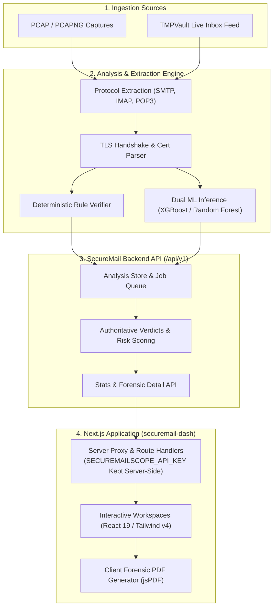

# SecureMailScope (`securemail-dash`)

[](https://nextjs.org/)
[](https://react.dev/)
[](https://www.typescriptlang.org/)
[](https://tailwindcss.com/)
[](https://nodejs.org/)
[](https://nodejs.org/)

> **Evidence-backed mail-transport forensic analysis and security inspection for SMTP, IMAP, and POP3.**

SecureMailScope reconstructs raw packet captures (PCAP/PCAPNG) and live mailbox streams into traceable transport sessions. It provides deep, evidence-backed inspection of transport encryption, TLS handshakes, X.509 certificate chains, and protocol integrity, pairing deterministic rule authority with calibrated machine learning models.

---

## Table of Contents

- [Core Principles & Security Philosophy](#core-principles--security-philosophy)
- [Key Workspaces & Capabilities](#key-workspaces--capabilities)
- [Architecture & Data Flow](#architecture--data-flow)
- [Tech Stack](#tech-stack)
- [Environment Configuration](#environment-configuration)
- [Getting Started](#getting-started)
- [Testing & Quality Verification](#testing--quality-verification)
- [Product Vocabulary](#product-vocabulary)
- [License](#license)

---

## Core Principles & Security Philosophy

1. **Deterministic Backend Authority**:
   Authoritative security verdicts (`Clean`, `Suspicious`, `Malicious`, `Inconclusive`) are produced by deterministic protocol rules and cryptographic verification. Calibrated machine learning models (XGBoost and Random Forest) operate strictly in an advisory capacity.
2. **Observable Evidence Boundary**:
   SecureMailScope does not break TLS or attempt to recover protected cryptographic secrets. The platform analyzes observable transport and handshake metadata. If sensitive message contents or payloads cannot be observed in the capture, the UI explicitly marks them as `Unavailable` or `Redacted` rather than fabricating data.
3. **Session Provenance & Traceability**:
   Every finding, protocol warning, and risk score is linked directly to reproducible evidence extracted from the underlying packet streams or client requests.

---

## Key Workspaces & Capabilities

### 1. Executive Security Dashboard (`/`)
- Macro-level security posture scoring and risk band distribution across all analyzed traffic.
- Real-time traffic breakdown by protocol (SMTP, IMAP, POP3) and cryptographic strength.
- Active background capture job status and ingestion throughput indicators.

### 2. Live Inbox & Capture Queue (`/inbox`, `/api/capture-jobs`)
- Asynchronous PCAP/PCAPNG file upload and background extraction queue.
- Live email ingestion and real-time transport stream monitoring powered by the TMPVault API.
- Offline fixture simulation mode for development and continuous integration testing.

### 3. TLS & Cipher Forensics (`/tls`)
- Granular handshake auditing: TLS version negotiation (TLS 1.3, 1.2, and legacy fallback detection).
- Cipher suite security classification and Perfect Forward Secrecy (PFS) verification.
- Detection of protocol downgrade attempts and insecure plaintext transitions.

### 4. X.509 Certificate Chain Inspection (`/certificates`)
- Multi-tier certificate chain validation and root of trust verification.
- Subject Alternative Name (SAN) matching, key algorithm auditing, and expiration timelines.
- Immediate flagging of self-signed, untrusted, or expired certificates.

### 5. Session Audit History & Forensic Inspector (`/history`, `/history/[requestId]`)
- Searchable and paginated forensic database of all analyzed sessions.
- Chronological protocol stream reconstruction and packet-level inspection.
- Granular evidence logs with deterministic rule citations, MITRE ATT&CK mappings, and risk breakdowns.

### 6. Threat Intelligence & ML Scoring (`/intelligence`)
- Dual-model inference transparency showing calibrated XGBoost and Random Forest scores.
- Anomaly assessment engine highlighting out-of-spec protocol commands and header anomalies.
- Real-time model health and calibration bundle status monitoring.

### 7. Forensic PDF Reporting (`/reports`)
- One-click generation of audit-ready compliance and incident forensic PDF reports.
- Detailed summary tables, certificate chain diagrams, and rule findings built with `jspdf` and `jspdf-autotable`.

---

## Architecture & Data Flow



---

## Tech Stack

| Layer | Technologies |
| :--- | :--- |
| **Framework** | [Next.js 16.3.4](https://nextjs.org/) (App Router, Server Actions, Route Handlers) |
| **UI & Core** | [React 19.2.8](https://react.dev/), [TypeScript 5](https://www.typescriptlang.org/) |
| **Styling & Design** | [Tailwind CSS v4](https://tailwindcss.com/), [Lucide React](https://lucide.dev/), [Motion](https://motion.dev/) |
| **Accessibility Primitives** | [React Aria Components](https://react-spectrum.adobe.com/react-aria/) |
| **Data Visualizations** | [Recharts](https://recharts.org/) |
| **Forensic PDF Export** | [jsPDF](https://github.com/parallax/jsPDF), [jspdf-autotable](https://github.com/simonbengtsson/jsPDF-AutoTable) |
| **Notifications** | [Sonner](https://sonner.emilkowal.ski/) |
| **Testing** | Node.js Native Test Runner (`node --experimental-strip-types --test`) |

---

## Environment Configuration

Create a `.env.local` file in the root directory to configure the backend API and inbox connections:

```bash
# Backend Analysis API URL (must include /api/v1 without trailing slash)
SECUREMAILSCOPE_API_URL=https://securemail.monostack.in/api/v1

# Server-Side API Key (Never exposed to browser clients)
SECUREMAILSCOPE_API_KEY=your_secure_api_key_here

# Inbox Integration Endpoint
SECUREMAILSCOPE_INBOX_URL=https://inbox.tmpvault.com/api/emails

# Inbox Source Mode: 'live' for real network API, or 'fixture' for mock testing
SECUREMAILSCOPE_INBOX_SOURCE=fixture
```

### Variable Reference

| Variable | Description | Default / Requirement |
| :--- | :--- | :--- |
| `SECUREMAILSCOPE_API_URL` | Base endpoint for the SecureMail backend API. | Required for live analysis requests. |
| `SECUREMAILSCOPE_API_KEY` | Private backend authentication key. Guarded server-side. | Required for live analysis requests. |
| `SECUREMAILSCOPE_INBOX_URL` | Endpoint for the TMPVault live email analysis integration. | Defaults to `https://inbox.tmpvault.com/api/emails`. |
| `SECUREMAILSCOPE_INBOX_SOURCE` | Controls live API requests vs. mock fixture data for Inbox views. | Defaults to `fixture` when unset. |

---

## Getting Started

### Prerequisites

- **Node.js**: `v20.0.0` or higher
- **Package Manager**: `npm`, `pnpm`, or `bun`

### Installation

1. Clone the repository:
   ```bash
   git clone https://github.com/Subham12R/securemail-dash.git
   cd securemail-dash
   ```

2. Install dependencies:
   ```bash
   npm install
   ```

3. Configure environment:
   ```bash
   cp .env.example .env.local
   # Edit .env.local with your credentials if connecting to live backend
   ```

4. Start the development server:
   ```bash
   npm run dev
   ```

5. Open [http://localhost:3000](http://localhost:3000) in your browser.

---

## Testing & Quality Verification

SecureMailScope includes a 71-suite automated test matrix using the native Node.js test runner:

```bash
# Run all unit and integration test suites
npm test

# Run ESLint validation
npm run lint

# Build production bundle
npm run build
```

---

## Product Vocabulary

To maintain clear and accurate terminology across security analyses:

- **Capture**: A raw PCAP or PCAPNG packet capture file supplied for forensic analysis.
- **Session**: A single reconstructed mail transport conversation (e.g. client-to-MTA or MTA-to-MTA).
- **Finding**: A concrete security observation backed by observable packet, handshake, or protocol evidence.
- **Verdict**: The authoritative backend classification for a session (`Clean`, `Suspicious`, `Malicious`, `Inconclusive`).
- **Risk Score**: A normalized metric `[0.0 - 1.0]` representing relative threat severity (not a compliance certification).
- **Evidence**: Handshake records, stream transcripts, cipher negotiation logs, and certificate metadata.

---

## License

Private and proprietary. All rights reserved.
