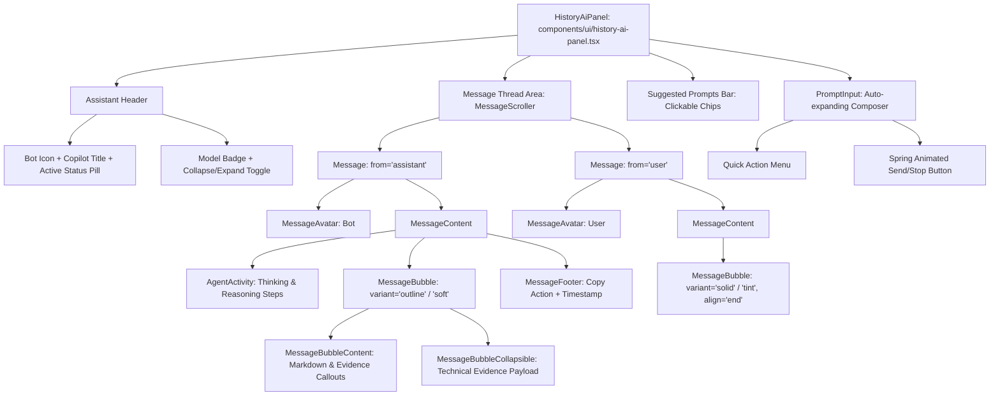

# SecureMailScope AI Assistant Design Specification (beUI Integration)

**Date:** 2026-09-10  
**Status:** In Planning  
**Target:** `components/agents/*`, `components/ui/history-ai-panel.tsx`, `lib/ai-assistant-engine.ts`  
**Reference Components:** `beui.dev/components/agents/message-bubble`, `message`, `prompt-input`, `agent-activity`

---

## 1. Executive Summary

This specification transforms the static "Demo only" placeholder in the Session History Details page into an interactive, evidence-grounded **AI Security Assistant** powered by modern animated primitives from **beUI** (`beui.dev/components/agents/*`).

The enhanced assistant enables security analysts to interactively investigate analyzed mail sessions, understand cryptographic risk drivers, inspect missing evidence, and draft incident triage reports through fluid, motion-rich conversational surfaces.

---

## 2. Component Architecture (beUI Design System)

The architecture adopts beUI's modular agent components, styled to harmonize with SecureMailScope's neutral zinc design language:

### 2.1 beUI Primitives Specification

1. **`MessageBubble` (`components/agents/message-bubble.tsx`):**
   - Tones: `soft` (light gray muted), `outline` (clean border), `solid` (dark high contrast for user), `tint` (subtle emerald/sky highlight), `danger` (for critical threat warnings).
   - Alignment: `start` for Assistant, `end` for Analyst/User.
   - Spring entrance: `BUBBLE_POP` spring (`stiffness: 520, damping: 27, mass: 0.52`).
   - `MessageBubbleCollapsible`: Expands long evidence tables or technical findings with animated Chevron.

2. **`Message` Primitives (`components/agents/message.tsx`):**
   - Composable hierarchy: `Message`, `MessageContent`, `MessageAvatar`, `MessageHeader`, `MessageFooter`, `MessageTyping`.
   - Trailing-edge pop-up entrance with spring physics (`MESSAGE_POP_UP`).
   - Typing indicator: Three-dot physics bounce with staggered ease.

3. **`AgentActivity` (`components/agents/agent-activity.tsx`):**
   - Collapsible reasoning disclosure displaying live or historical execution traces:
     - `step`: E.g. "Parsed 1,420 bytes of TLS handshake telemetry"
     - `tool`: E.g. "Ran RFC 3207 deterministic compliance check"
     - `trace`: Thinking and policy evaluation summary
   - Real-time `ThinkingShimmer` animation during response generation.

4. **`PromptInput` (`components/agents/prompt-input.tsx`):**
   - Auto-growing multiline textarea with `minRows={1}` and `maxRows={4}`.
   - Quick prompt shortcuts (+ menu).
   - Enter to submit, Shift+Enter for newline.
   - Animated send button with scale feedback (`SPRING_PRESS`).

---

## 3. Evidence-Grounded Assistant Engine (`lib/ai-assistant-engine.ts`)

To provide immediate, intelligent responses grounded in the active session's data, a client-side reasoning engine analyzes the `AnalysisDetailViewModel` across 5 core investigation domains:

1. **Executive Summary & Verdict:**
   - Interprets `final_verdict`, normalized `risk_score`, protocols (`SMTP`, `IMAP`, `POP3`), and timestamps.
2. **Cryptographic Posture & TLS Handshake:**
   - Analyzes negotiated TLS version, cipher suites, key exchange, and STARTTLS behavior.
3. **Risk Drivers & Triggers:**
   - Highlights top contributing risk factors, heuristic triggers, and missing evidence fields.
4. **Missing Supporting Data & Telemetry Gaps:**
   - Outlines unobserved fields (e.g. absent certificate chain, redacted payload, or missing client HELO).
5. **Remediation & Incident Response Guidance:**
   - Generates actionable configuration recommendations (e.g. enforce TLS 1.3, deprecate 3DES/RC4, configure DANE/MTA-STS).

---

## 4. User Experience & Interactions

- **Initial State:** On first expand, the Assistant greets the analyst with a structured summary of the current session and 4 interactive suggestion chips:
  - 🔍 *Explain the risk drivers*
  - 🔐 *Inspect TLS & cipher posture*
  - ⚠️ *What evidence is missing?*
  - 📋 *Draft incident triage note*
- **Clicking a Chip:** Immediately sends the query, triggers the `AgentActivity` trace ("Evaluating telemetry..."), and streams the structured response with evidence callouts.
- **Typing Custom Questions:** Analyst can type free-form questions; the engine matches intent against the session data and provides precise, relevant answers.
- **Collapsible Evidence Payloads:** Deep packet inspection details are cleanly collapsed by default via `MessageBubbleCollapsible` to keep the chat interface clean and scannable.
- **Copy to Clipboard:** One-click copy for analyst notes and incident tickets.
- **Responsive Drawer:** Seamlessly collapses into a slim 3rem icon rail or expands to 24rem workspace on desktop, folding into a full overlay on mobile viewports.

---

## 5. Testing & Verification

1. **Automated Unit Tests:**
   - Engine query parsing and domain resolution (`test/ai-assistant-engine.test.ts`).
   - Context binding to `AnalysisDetailViewModel` (verdict, risk, protocols, missing fields).
2. **Interactive UI Verification:**
   - Playwright automated browser tests validating chat submission, typing indicator, bubble animation, prompt suggestions, and collapsible disclosures.
