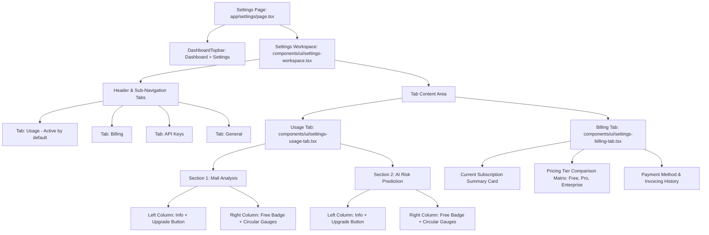

# SecureMailScope Pricing Model & Settings Page Specification

**Date:** 2026-09-10  
**Status:** Approved / In Planning  
**Target:** `app/settings/page.tsx`, `components/ui/settings-*`, `lib/pricing-plans.ts`, `lib/usage-data.ts`

---

## 1. Executive Summary

This specification defines the pricing structure, usage tracking model, and the settings interface for **SecureMailScope**. 

Following the user's reference design (clean, minimal Resend-style settings dashboard), the settings page will feature a tabbed navigation structure with a primary **Usage** view and a **Billing** view. 

The core pricing structure anchors on a generous **Free Developer Tier** granting **1,000 email session analyses per month** and **1,000 AI risk predictions per month**, alongside paid **Pro** and **Enterprise** tiers for higher volume, extended forensic retention, and custom detection rules.

---

## 2. Pricing Model & Tiers

### 2.1 Tier Matrix

| Feature / Quota | **Free (Developer)** | **Pro (SecOps & Teams)** | **Enterprise (Compliance & Scale)** |
| :--- | :--- | :--- | :--- |
| **Price (Monthly)** | **$0** / month | **$49** / month | **$299+** / month (Custom) |
| **Price (Annual - 20% off)** | **$0** / year | **$39** / month ($468/yr) | Custom contract |
| **Email Analyses (Monthly)** | **1,000 sessions / mo** | **50,000 sessions / mo** | **Unlimited / Bespoke** |
| **Daily Analysis Burst Cap** | 100 sessions / day | Unlimited | Unlimited |
| **AI Risk Predictions** | **1,000 predictions / mo** | **50,000 predictions / mo** | **Unlimited / Bespoke** |
| **Concurrent Ingestion Jobs** | 2 concurrent PCAP jobs | 10 concurrent PCAP jobs | Dedicated processing cluster |
| **Supported Protocols** | SMTP, IMAP, POP3 | SMTP, IMAP, POP3, TLS 1.2/1.3 | All + Custom Feeds / Ports |
| **Forensic Evidence Retention** | 7 days | 90 days | 1 year+ / Custom S3 export |
| **PCAP Forensic Stream Export** | ❌ Unavailable | ✅ Full stream & cert export | ✅ Full stream & cert export |
| **Custom Detection Rules** | Up to 3 active rules | Up to 25 active rules | Unlimited custom rules & LLM |
| **Processing Priority** | Standard queue | Priority worker pool | Dedicated private worker pool |
| **Seats & Collaboration** | 1 seat | Up to 5 team seats | Unlimited seats + SSO/SAML |
| **Support & SLA** | Community support | Priority email support | Dedicated Slack + 99.9% SLA |

### 2.2 Quota Metering & Reset Mechanics

- **Cycle Period:** 30-day rolling or calendar month (defaults to monthly cycle, e.g., resets on the 1st of each month or subscription anniversary).
- **Enforcement Policy:**
  - When reaching 80% quota: Warning indicator in the dashboard topbar / settings meters.
  - When reaching 100% quota: Further capture submissions prompt an upgrade dialog or are queued in sandbox mode.
- **AI Predictions:** Counted whenever an automated heuristic or machine learning risk score/explanation is generated for an ingested mail session.

---

## 3. UI/UX Architecture & Layout

The UI adheres strictly to SecureMailScope's established design language:
- Neutral zinc palette (`bg-white`, `text-zinc-900`, `text-zinc-600`, `border-zinc-200`)
- Subtle inset card shadows (`shadow-[inset_0px_0px_2px_2px_rgba(0,0,0,0.05)]`)
- High-contrast black interactive controls (e.g., `<button className="bg-black text-white hover:bg-zinc-800 ...">Upgrade</button>`)
- Typography: Tight tracking (`tracking-tighter`), clear visual hierarchy
- Fluid page transitions (`ViewTransition`) and accessibility attributes.

### 3.1 Settings Layout Hierarchy



### 3.2 "Usage" Tab (Reference Screenshot Implementation)

The `Usage` tab features a 2-column layout split into product capability sections separated by horizontal dividers:

#### Section 1: Mail Analysis (Transactional Ingestion)
- **Left Column:**
  - Title: `Mail Analysis` (font-semibold, tracking-tighter, text-base)
  - Description: `Inspect SMTP, IMAP, and POP3 packet captures and session security.`
  - CTA Button: `Upgrade` (solid black rounded button `bg-black text-white hover:bg-zinc-800 rounded-md text-sm px-4 py-1.5 font-medium`, opens upgrade drawer/tab).
- **Right Column:**
  - Tier Badge: `Free` (text-sm font-medium text-zinc-600 mb-4)
  - Usage Items:
    1. **Monthly analysis limit:** Circular progress gauge icon + Label + `388 / 1,000` + subtle expandable details toggle.
    2. **Daily analysis limit:** Circular progress gauge icon + Label + `11 / 100` + subtle expandable details toggle.
    3. **Concurrent capture jobs:** Circular progress gauge icon + Label + `1 / 2`.

#### Section 2: AI Risk Prediction
- **Left Column:**
  - Title: `AI Risk Prediction`
  - Description: `Advisory ML threat scoring, anomaly detection, and automated heuristic verdict evaluation.`
  - CTA Button: `Upgrade`
- **Right Column:**
  - Tier Badge: `Free`
  - Usage Items:
    1. **Monthly predictions limit:** Circular progress gauge icon + Label + `0 / 1,000`.
    2. **Custom detection rules:** Circular progress gauge icon + Label + `1 / 3`.
    3. **Forensic evidence retention:** Circular progress gauge icon + Label + `7 days` (or badge `7 / 90 days`).

### 3.3 Circular Progress Gauge (`UsageGauge`)

A lightweight SVG component rendering a circular ring with track and indicator fill:
- Size: 18x18px or 20x20px
- Gray background track: `stroke-zinc-200`
- Filled stroke: `stroke-emerald-600` (or `stroke-zinc-800` when normal, `stroke-amber-500` at >80%, `stroke-red-600` at 100%)
- Smooth `stroke-dasharray` and `stroke-dashoffset` calculation based on percentage.

### 3.4 "Billing" Tab

- **Current Plan Overview:**
  - Shows `Free Developer Tier`, active status badge, cycle reset countdown (*e.g., "Resets in 18 days"*).
  - Quick action to switch billing cycle (Monthly vs. Annual with "Save 20%" badge).
- **Tier Cards Grid (3 Columns):**
  - **Free:** $0/mo — "Current Plan" disabled button.
  - **Pro:** $49/mo (or $39/mo annual) — "Upgrade to Pro" primary green/black button, badge "Most Popular".
  - **Enterprise:** Custom — "Contact Sales" outline button.
  - List of feature bullets with checkmarks.
- **Payment Method & Billing History:**
  - Clean card displaying test payment method (`Visa ending in 4242`) or `Add Payment Method`.
  - Invoices table listing simulated past invoices (`Invoice #`, `Date`, `Amount`, `Status`, `Download Receipt`).

---

## 4. Technical Architecture & File Organization

### 4.1 New & Modified Files

```
lib/
├── pricing-plans.ts          # Plan definitions, pricing data, feature comparisons, and tier specs
└── usage-data.ts             # Quota models, calculations, percentage helpers, simulated user state

components/ui/
├── usage-gauge.tsx           # SVG circular progress meter matching reference screenshot
├── settings-usage-tab.tsx    # 2-column Usage view with Mail Analysis & AI Prediction sections
├── settings-billing-tab.tsx  # Billing view with active plan, pricing grid, payment methods
└── settings-workspace.tsx    # Main Settings shell with sub-navigation tabs (Usage, Billing, etc.)

app/settings/
└── page.tsx                  # Server/Client entry point rendering SettingsWorkspace

test/
├── pricing-plans.test.ts     # Unit tests verifying plan structures, prices, and feature flags
└── usage-data.test.ts        # Unit tests verifying gauge math, percentages, warning thresholds
```

### 4.2 Data Models

```typescript
// lib/pricing-plans.ts
export type BillingInterval = "monthly" | "annual";

export type PricingTier = {
  id: "free" | "pro" | "enterprise";
  name: string;
  tagline: string;
  priceMonthly: number;
  priceAnnualMonthly: number; // e.g. $39 when billed annually
  popular?: boolean;
  limits: {
    monthlyAnalyses: number | null; // null = unlimited
    dailyAnalyses: number | null;
    monthlyPredictions: number | null;
    concurrentJobs: number;
    customRules: number | null;
    retentionDays: number;
  };
  features: string[];
  ctaLabel: string;
};

// lib/usage-data.ts
export type UsageMetric = {
  id: string;
  label: string;
  used: number;
  limit: number | null; // null for unlimited / fixed duration
  unit?: string;
  details?: string;
};

export type ProductUsageSection = {
  id: string;
  title: string;
  description: string;
  planName: string;
  metrics: UsageMetric[];
};
```

---

## 5. Testing & Verification

1. **Unit Tests (`node --experimental-strip-types --test`):**
   - Verify percentage calculation in `usage-data.ts` (0%, mid-range, 100%, overflow clamp).
   - Verify warning status triggers (normal < 80%, warning >= 80%, critical = 100%).
   - Verify tier lookup and pricing calculation (annual discount formatting).
2. **UI & Accessibility:**
   - Keyboard navigable tabs (`Tab`, `ArrowLeft`, `ArrowRight`, `Enter`).
   - Circular gauges include `aria-label` with human-readable percentages (e.g., `aria-label="388 of 1,000 monthly analyses used (38.8%)"`).
   - Contrast check on all badges, buttons, and text elements.
   - Mobile responsive check (stacks columns on `< md` screens).
